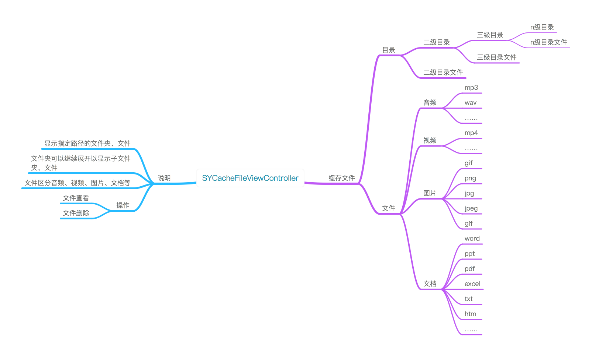
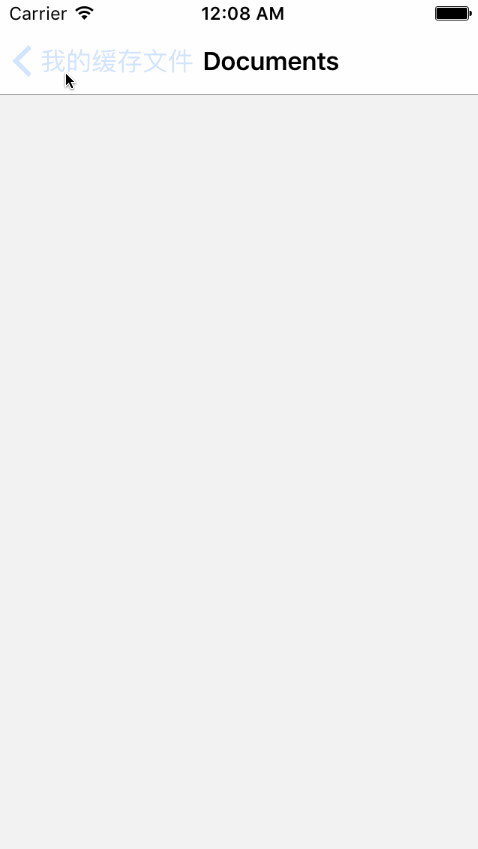
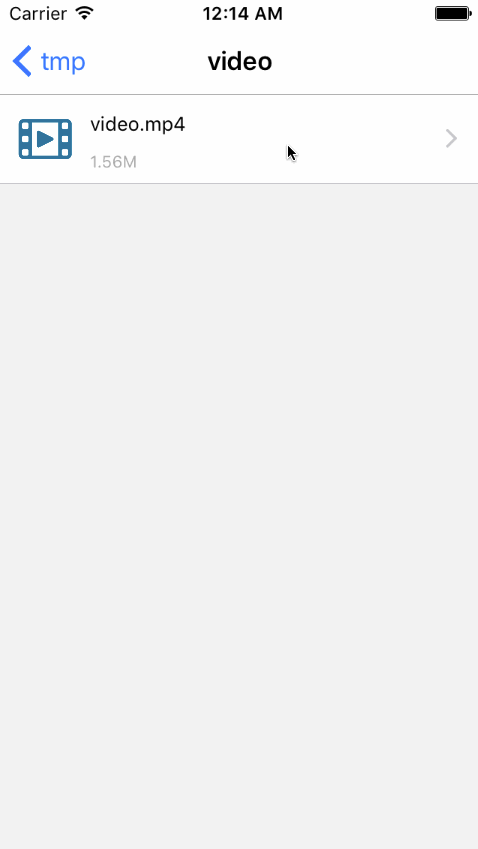
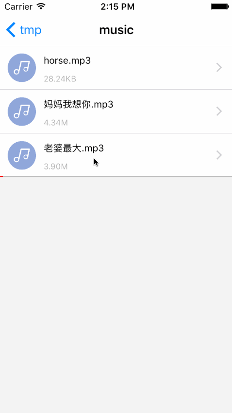
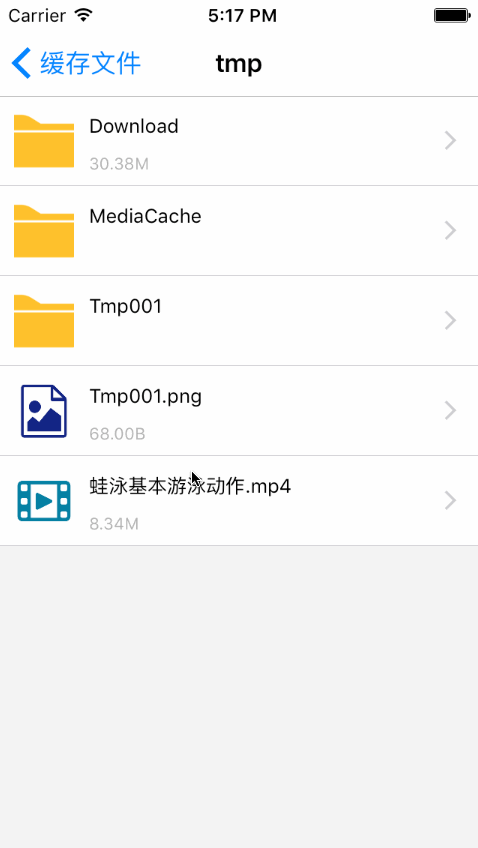
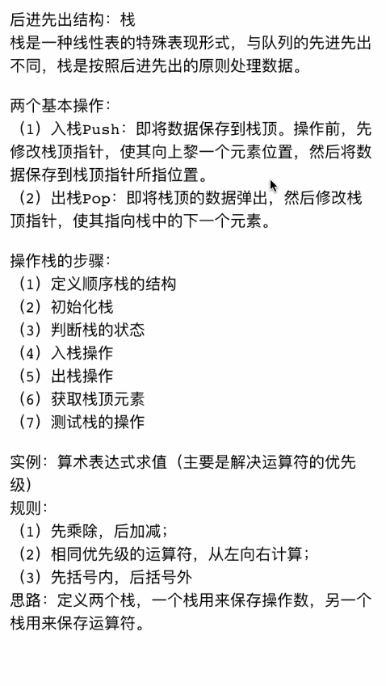
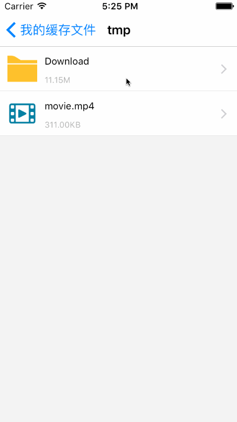
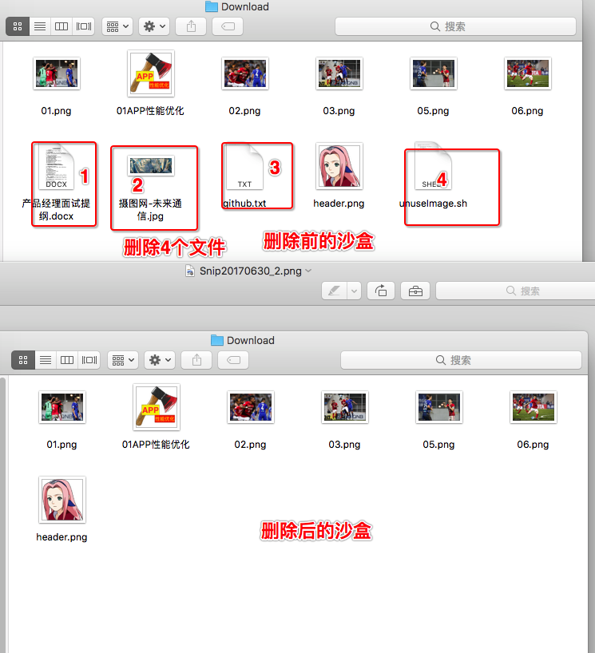

# SYCacheFileViewController
缓存文件视图控制器

* 显示指定目录下的子目录及文件
  * 子目录可以继续点击进入下级子目录，及显示下级文件
  * 文件可以点击查看，根据不格式进行展示
    * 音频播放：播放时图标旋转，并显示播放进度
    * 视频播放：使用系统播放器进行播放
    * 文档类浏览：使用系统控件查看浏览，如：doc/excel/ppt/pdf/txt等打开
    * 图片浏览：查看时可通过手势进行缩放
    * apk文件：无法查看，且提示不可查看
    
* 目录与文件的删除操作
  * 左滑出现删除按钮
  * 系统文件及文件夹不可删除
  * 长按操作
    * 删除：所有文件格式适用
    * 保存到相册：只支持视频、图片

# 效果图-目录与文件

# 效果图-图片查看

# 效果图-视频播放

# 效果图-音频播放

# 效果图-文档查看-word/excel/ppt/pdf

# 效果图-文档查看：txt/htm/……

# 效果图-删除操作（系统文件不可删除）

* 使用介绍
  * 自动导入：使用命令`pod 'SYCacheFileViewController'`导入到项目中
  * 手动导入：或下载源码后，将源码添加到项目中
  
  
# 使用示例
~~~ javascript

// 导入头文件
#import "SYCacheFileViewController.h"

~~~

~~~ javascript

// 实例化 使用默认路径home
SYCacheFileViewController *cacheVC = [[SYCacheFileViewController alloc] init];
[self.navigationController pushViewController:cacheVC animated:YES];

~~~

~~~ javascript

// 自定义
SYCacheFileViewController *cacheVC = [[SYCacheFileViewController alloc] init];
// 指定文件格式
[SYCacheFileManager shareManager].cacheDocumentArray = @[@".pages", @"wps", @".xls", @".pdf", @".rar"];

// 指定目录，或默认目录
NSString *path = [SYCacheFileManager documentDirectoryPath];
NSArray *array = [[SYCacheFileManager shareManager] fileModelsWithFilePath:path];
cacheVC.cacheArray = [NSMutableArray arrayWithArray:array];

// 标题
cacheVC.cacheTitle = @"我的缓存文件";

// 单图或多图浏览
[SYCacheFileManager shareManager].showImageShuffling = YES;

// 文件浏览方式
[SYCacheFileManager shareManager].showDoucumentUI = YES;

// 列表，或九宫格显示
cacheVC.showType = 1;

//
[self.navigationController pushViewController:cacheVC animated:YES];
~~~

# 修改完善
* 20190227
  * 版本号：1.2.9
  * 优化修改
    * 显示样式：列表、九宫格
    * 多图显示数量及索引异常bug

* 20190221
  * 版本号：1.2.8
  * 优化修改
    * 功能分离：图片浏览、音乐播放、视频播放
  
* 20190212
  * 版本号：1.2.5 1.2.6 1.2.7
  * 功能完善
    * 多图浏览
      * 显示数量
      * 显示指定图片
    * 单图浏览

* 20190114
  * 版本号：1.2.4
  * 修改bug
    * 音频播放时，删除操作异常处理
    * 文件夹名称带有.识别异常
    * 左滑删除和长按删除时，异常处理

  * 版本号：1.2.3
  * 修改bug
    * apk无法打开提示
    
* 20190110
  * 版本号：1.2.2
  * 修改完善
    * 图片缩放功能
    * 长按响应
      * 保存到相册
        * 图片
        * 视频
      * 删除
    * 新增图标：压缩文件、apk程序
    * 音频播放
      * 播放时图标旋转状态
      * 停止播放时，多首音频异常

    * SYCacheFileManager修改
      * @property (nonatomic, strong) NSArray *cacheVideoTypes; 改成 @property (nonatomic, strong) NSArray *cacheVideoTypes;
      * @property (nonatomic, strong) NSArray *cacheAudioArray; 改成 @property (nonatomic, strong) NSArray *cacheAudioTypes;
      * @property (nonatomic, strong) NSArray *cacheImageArray; 改成 @property (nonatomic, strong) NSArray *cacheImageTypes;
      * @property (nonatomic, strong) NSArray *cacheDocumentArray; 改成 @property (nonatomic, strong) NSArray *cacheDocumentTypes;

* 20190103
  * 版本号：1.2.1
  * 修改完善
    * 图片独立窗口播放
    * 音乐独立窗口播放

* 20190102
  * 版本号：1.2.0
  * 修改完善
    * 区分音视频播放模式
    * 单独窗口播放音乐
    * 单独窗口播放视频
    * 播放前文件异常判断

* 20181120
  * 版本号：1.1.0
  * 修改完善
    * 添加自定义文件格式

* 20180731
  * 版本号：1.0.0
  * 完善方法
    * 文件复制
    * 文件移动
    * 文件重命名
    
* 待完善
  * 文件删除后文件目录大小改变

