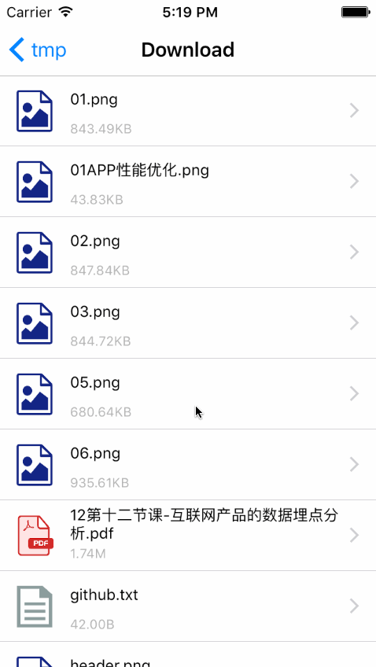

# SYCacheFileViewController
缓存文件视图控制器

* 查看：视频播放、音频播放、文档查看、图片查看……
* 删除：文件

# 效果图-目录与文件

# 效果图-图片查看

# 效果图-视频播放

# 效果图-音频播放

# 效果图-文档查看-word/excel/ppt/pdf

# 效果图-文档查看：txt/htm/……

# 使用示例
~~~ javascript

// 导入头文件
#import "SYCacheFileViewController.h"

~~~

~~~ javascript

// 实例化 使用默认路径home
SYCacheFileViewController *cacheVC = [[SYCacheFileViewController alloc] init];
[self.navigationController pushViewController:cacheVC animated:YES];

~~~

~~~ javascript

// 实例化 自定义目录、标题
SYCacheFileViewController *cacheVC = [[SYCacheFileViewController alloc] init];
// 指定目录，或默认目录
NSString *path = [SYCacheFileManager documentDirectoryPath];
NSArray *array = [SYCacheFileManager fileModelsWithFilePath:path];
cacheVC.cacheArray = [NSMutableArray arrayWithArray:array];
// 其它属性设置
cacheVC.cacheTitle = @"我的缓存文件";
[self.navigationController pushViewController:cacheVC animated:YES];

~~~